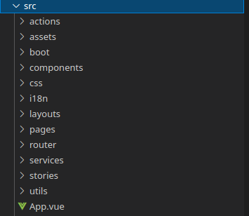

<!-- PROJECT SHIELDS -->

[![Forks][forks-shield]][forks-url]
[![Stargazers][stars-shield]][stars-url]
[![Issues-open][issues-open-shield]][issues-url]
[![Issues-closed][issues-closed-shield]][issues-url]
[![Contributors][contributors-shield]][contributors-url]

<!-- PROJECT LOGO -->

|                                              DID Peru - App                                              |
| :------------------------------------------------------------------------------------------------------: |
|                                              ![app-icon][]                                               |
|                        ONLINE ACCESS SYSTEM FOR CUSTOMER AND CONSUMER MONITORING.                        |
|                          [🐞 Report a bug or 🙋‍♂️ request a feature][issues-url]                           |
| [![contributions welcome][contributions-welcome]][issues-url] [![License][badge-apache]][apache-license] |

- [DID-App Docs](#did-app-docs)
  - [Features](#features)
  - [Pre requirements](#pre-requirements)
  - [How to run the project:](#how-to-run-the-project)
  - [Technologies:](#technologies)
  - [File Structure:](#file-structure)
  - [Git use:](#git-use)
  - [Faq:](#faq)
  - [Collaborators](#collaborators)
  - [Contributing](#contributing)
  - [Show your support](#show-your-support)
  - [License](#license)

# DID-App Docs

DID App is a mobile application that allows users to learn about the different events scheduled by the "Association of Interior Designers of Peru", also allows to know the suppliers attached to that association, the products they offer and the possibility of generating a purchase order for the products. In addition to this, the application generates a unique QR code to identify each associate, and allows communication with support agents in order to acquire a membership.

It was developed using Quasar, which give us some components to work and tools to compile easily to Android and iOs using Capacitor or Cordova.

## Features

![javascript][]
![vue][]

## Pre requirements

Before to start you need have some requirements:

1. [Node.js](https://nodejs.org/) > 14.19.3

   Node.js is a runtime environment for Javascript that allows us to use the language outside of the browser, in this case we use it to configure and run the development server.

2. [Yarn](https://yarnpkg.com/) > v1.22.10

   Yarn is a software packaging system developed in 2016 by Facebook for the Node.js JavaScript runtime environment. An alternative to the npm package manager, Yarn was created as a collaboration of Facebook, Exponent, Google, and Tilde to solve consistency, security, and performance problems with large codebases.

3. [Git](https://git-scm.com/) > v2.0.0

   Git is a version control system for code, we use it to manage the different branches of the code.

4. Connection to internet

5. [Quasar CLI](https://quasar.dev/start/quasar-cli)

6. [Visual Studio Code](https://code.visualstudio.com/) or another code editor (optional)

> Note:
> If you're using Visual Studio Code, you can install the recommended extensions for this project.

## How to run the project:

1. Clone the repository

```
git clone https://github.com/Azordev/DID-app.git
```

2. Go to the project folder

```
cd did-app
```

3. Install dependencies

```
yarn install
```

4.  Run

    1. Run development server

       ```
       quasar dev
       ```

    2. Run Storybook

       ```
       yarn storybook
       ```

If you ran `quasar dev` a development server will start immediately thanks to [Vite](https://vitejs.dev/) technology; generally on port 9000. You must go to your browser and enter [localhost:9000](localhost:9000) and you will have access to the project.

If you ran `yarn storybook` a development server will start with all the Storybook tools. Generally on port 6006. You must go to your browser and enter [localhost:6006](localhost:6006) and you will have access to the project.

## Technologies:

The project has been developed using various technologies. Some of them are:

|    Name    | Description                                                                                                                                                                                                                                                                   |
| :--------: | ----------------------------------------------------------------------------------------------------------------------------------------------------------------------------------------------------------------------------------------------------------------------------- |
|  QuasarJs  | Quasar is an MIT licensed open-source Vue.js based framework, which allows you as a web developer to quickly create responsive++ websites/apps in many flavours: SPA, SSR, PWAs, BEX, Mobile Apps, through Cordova or Capacitor, Multi-platform Desktop Apps (using Electron) |
|   VueJs    | For the front we're used VueJs, which is a powerful framework that allows us to interact dynamically with the DOM and encapsulate tons of functionalities through components. [VueJS Docs](https://vuejs.org/guide/introduction.html)                                         |
| Vue Apollo | Vue-Apollo is a Vue plugin that allows us to use the GraphQL API. [Vue Apollo Docs](https://apollo.vuejs.org/guide/#introduction)                                                                                                                                             |
| Storybook  | Storybook helps you build UI components in isolation from your app's business logic, data, and context. That makes it easy to develop hard-to-reach states. Save these UI states as stories to revisit during development, testing, or QA.                                    |
|   EsLint   | We like that our projects handle a clean code; that's why every time you commit & push, EsLint will analyze your input to make sure it complies with best practices.                                                                                                          |
| TypeScript | TypeScript is a superset of JavaScript that compiles to plain JavaScript. [TypeScript Docs](https://www.typescriptlang.org/docs/home.html)                                                                                                                                    |

## File Structure:

The magic of the project happens inside the src folder. It is there where you will find all the components, pages and styles.

<table border="0">
    <td width="300px">
        
    </td>
    <td>
        <b>actions:</b> Here you will find all the actions that will be used in the project. For example: Call the API to get the data, or save new data in the Database.
        <br/><br/>
        <b>assets:</b> Here you will find all the assets that will be used in the project. For example: Images, videos, gifs, etc. The assets folders that is in `src` folder, is assets that are used in all the project. When some files are used just in a component or page, can be created a folder asset in the component or page folder and put the files there.
        <b>boot:</b> Boot files (app initialization code). This one was created by Quasar, and you can add here your boot files, you can find more information in <a href="https://quasar.dev/quasar-cli-webpack/boot-files" target="_blank">their documentation</a> <br /><br />
        <b>components:</b> The components are functionalities that we can reuse in many parts of our project. For example, if we need a button; we develop it only once and then we can call it as many times as we need it. In `src/components` you'll find some components that are used for all the application. In `SomePage/component` you'll find components that just are required in that page<br/><br/>
        <b>css:</b> Here you will find the global css files that will be used in the project. For example: Colors, Sizes, Animations, Fonts.<br/><br/>
        <b>i18n:</b> Here you will find the internationalization files that will be used in the project. For example: Languages, Translations, etc. By the moment isn't required, but in case that you need to translate something you can use it without problem. If you want to know how you can use it, you can follow this <a href="https://quasar.dev/options/app-internationalization#how-to-use">Quasar documentation</a><br/><br/>
        <b>layouts:</b> A layout is the page's frame, what's around the page and define the structure of the page, for example: Where will be the navbar, and where will be the content, the footer, etc...<br/><br/>
        <b>pages:</b> Here we place the structure of each section of the project and it is where the components are mostly used.<br/><br/>
        <b>router:</b> Here will be all the config for the <a href="https://router.vuejs.org/">vue-router</a> which is the official router for vue. Here you can define new routes and edit the routes that are already defined.<br/><br/>
        <b>services:</b> GraphQL works with queries and mutations which are basically the way data is obtained and inserted respectively. The code for the manipulation of the data must go in this folder.<br/><br/>
        <b>stories:</b> This folder can contain general stories dedicated to documentation about the project, and not specifically should be about a component as the normal stories. Here you can add documentation how: How to run the project, how to build to Android and iOs, etc...<br/><br/>
        <b>utils:</b> At utils folder you can find some functions that are used generally in the most of views on the project.<br/><br/>
    </td>
</table>

## Git use:

There are some rules that apply when interacting with the project repository. This will allow us to have a standard that any developer can understand. It is important to comply with these rules so that the linting tool allows us to use the repository.

**Branch:**

Every time an issue is assigned to you, you must create a new branch. This can be done through the command:

```
git branch <name of branch>
```

For convenience, the branches should have a defined structure. For example, if the issue is about adding a new feature, the branch should be:

```
feature/#issuenumber-brief-description-of-the-feature
```

Suppose we have issue #12 that asks us to add a header to the main page. Then, the branch would be as follows:

```
feature/#12-add-header-to-main-page
```

If it is about solving a bug, we just have to put the word "fix" in front of it. For example:

```
fix/#14-remove-bad-media-queries-in-rating-component
```

**Pull Request (PR):**

The PR’s are requests that as developers we make once the solution of an issue is completed and we want the code to be integrated into the master branch of the project. Before that, we must ensure that our code is fully functional and adhering to best practices.

Once we have done a commit & push in our branch, a notification with a yellow background will appear in the github repository and will ask us to continue with the PR. In the TextArea to perform the PR you will find several sections that you want to complete: A brief description of what you did, a snapshot (if applicable), the tasks that were completed and the steps to view them.

## Faq:

**How do I create a new component?**

In the component folder, create a new file with the .vue extension. Make sure to put an appropriate name to the functionality that you are going to develop.

If needed, also add the styles' file and the storybook file.

**How do I create a new story for storybook?**

1. Create a new `YourComponent.stories.js` file.
2. export the title of the story and the component that you want to test, for example:

   ```javascript
   export default {
     title: 'components/YourComponent',
     component: YourComponent,
   };
   ```

3. Then you can create the stories for your component creating a function that returns an object with the next structure:

```javascript
const NameOfYourStory = (args) => ({
  components: { YourComponent }, // The components that you'll use in your story
  setup() {
    return { args }; // return here the variables that you want to use in your story
  },
  template: '<your-component v-bind="args" />', // Here's where you will place your code as if you would be using it in a real case
});
```

Then you will be able to see your new component in the Storybook development server. If is not there, please check that your story don't have errors.

For a better and more cleared documentation, please check the [Storybook Documentation](https://storybook.js.org/docs/vue/writing-stories/introduction).

## Collaborators

|              Picture               |                                                               Contact                                                               | Role |
| :--------------------------------: | :---------------------------------------------------------------------------------------------------------------------------------: | ---- |
|    [Victor Peña][victor-github]    | ![email-icon][] Email me to [victordev2002@gmail.com][victor-email] / ![linkedin-icon][] Connect to [my Linkedin][victor-linkedin]  |
|          ![victor-pic][]           |                                                 FrontEnd Developer Quasar Framework                                                 |
|   [Israel Laguan][author-github]   | ![email-icon][] Email me to [contact@israellaguan.com][author-email] / ![linkedin-icon][] Connect to [my Linkedin][author-linkedin] |
|          ![author-pic][]           |                                                  Backend Developer GraphQL, NextJs                                                  |
|                                    |
| [Emmanuel Azócar][emmanuel-github] | ![email-icon][] Email me to [azocarmel@gmail.com][emmanuel-email] / ![linkedin-icon][] Connect to [my Linkedin][emmanuel-linkedin]  |
|         ![emmanuel-pic][]          |                                                  Backend Developer GraphQL, NextJs                                                  |
|   [Angelica Molina][ange-github]   |   ![email-icon][] Email me to [angeli.molina1@gmail.com][ange-email] / ![linkedin-icon][] Connect to [my Linkedin][ange-linkedin]   |
|           ![ange-pic][]            |                                                          Quality Assurance                                                          |

## Contributing

[![contributions welcome][contributions-welcome]][issues-url]

🤝 Contributions, issues and feature requests are welcome!
Feel free to check the [issues page][issues-url].

## Show your support

🤗 Give a ⭐️ if you like this project!

## License

[![License][badge-apache]][apache-license]

📝 This project is licensed under the [Apache 2](LICENSE)\
Feel free to fork this project and improve it!

<!-- MARKDOWN LINKS & IMAGES -->

[contributors-shield]: https://img.shields.io/github/contributors/Azordev/did-app?style=for-the-badge
[contributors-url]: https://github.com/Azordev/did-app/graphs/contributors
[forks-shield]: https://img.shields.io/github/forks/Azordev/did-app?style=for-the-badge
[forks-url]: https://github.com/Azordev/did-app/network/members
[stars-shield]: https://img.shields.io/github/stars/Azordev/did-app?style=for-the-badge
[stars-url]: https://github.com/Azordev/did-app/stargazers
[issues-open-shield]: https://img.shields.io/github/issues/Azordev/did-app?style=for-the-badge
[issues-closed-shield]: https://img.shields.io/github/issues-closed/Azordev/did-app?style=for-the-badge
[vue]: https://img.shields.io/badge/Vue-3-%2342b883?style=for-the-badge&logo=vuejs
[javascript]: https://img.shields.io/badge/JAVASCRIPT-ES6%2B-F7DF1E?style=for-the-badge&logo=javascript
[css]: https://img.shields.io/badge/style-CSS-1572B6?style=for-the-badge&logo=css3
[contributions-welcome]: https://img.shields.io/badge/contributions-welcome-brightgreen.svg?style=for-the-badge
[issues-url]: https://github.com/Azordev/did-app/issues
[badge-apache]: https://img.shields.io/badge/License-Apache%202.0-blue.svg?style=for-the-badge
[apache-license]: https://opensource.org/licenses/Apache-2.0
[author-pic]: https://avatars2.githubusercontent.com/u/36519478?s=460&v=4
[author-github]: https://israel-laguan.github.io
[author-linkedin]: https://www.linkedin.com/in/israellaguan
[author-email]: mailto:contact@israellaguan.com
[linkedin-icon]: https://img.icons8.com/color/20/000000/linkedin.png
[email-icon]: https://img.icons8.com/color/20/000000/message-squared.png
[app-icon]: docs/icon.png
[victor-github]: https://github.com/Katsu08
[victor-pic]: https://avatars.githubusercontent.com/u/66505715?v=4
[victor-email]: mailto:victordev2002@gmail.com
[victor-linkedin]: https://www.linkedin.com/in/v%C3%ADctor-pe%C3%B1a-348a3918a/
[emmanuel-github]: https://github.com/e-azocar
[emmanuel-pic]: https://avatars.githubusercontent.com/u/61360270?v=4
[emmanuel-email]: mailto:azocarmel@gmail.com
[emmanuel-linkedin]: https://www.linkedin.com/in/emmanuel-az%C3%B3car-b0378522b/
[roman-github]: https://github.com/romanrguez192
[roman-pic]: https://avatars.githubusercontent.com/u/69876913?s=200&v=4
[roman-email]: mailto:romanrodri192@gmail.com
[tony-github]: https://github.com/Tonytarco
[tony-pic]: https://avatars.githubusercontent.com/u/37258801?s=200&v=4
[tony-email]: mailto:tonytarco@hotmail.com
[ange-github]: https://github.com/angelik0828
[ange-pic]: https://avatars.githubusercontent.com/u/4030477?s=200&v=4
[ange-email]: mailto:angeli.molina1@gmail.com
[ange-linkedin]: https://www.linkedin.com/in/angelica-molina-vargas-7180816a/
